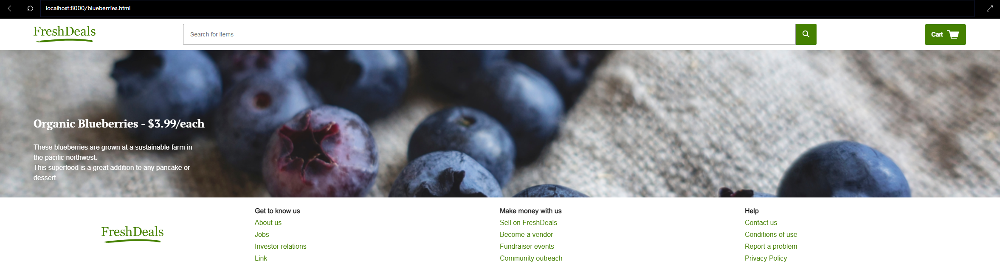
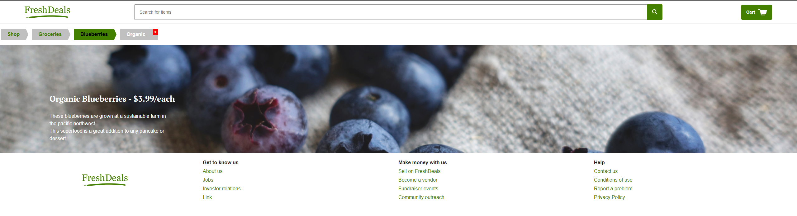

Goal: Practice secondary navigation across webpage (location-based, attribute-based & path-based breadcrumbs)

Context: Small project in my learning path to become a full-stack developer

Source: Codecademy Full Stack Engineer Path

Description: /* The goal is to improve the user experience of this FreshDeals grocery store e-marketplace. Currently, a user may have difficulty navigating through different sections of the website due to the lack of breadcrumbs. In this specific scenario, the user is looking to buy blueberries. However, it is currently unclear how to further broaden or further specify the user's search.*/

Start date: April 3rd, 2023

End date: April 4th, 2023

➤➤➤➤➤➤➤➤➤➤➤➤➤➤➤➤➤➤➤➤➤➤➤

Before

After

